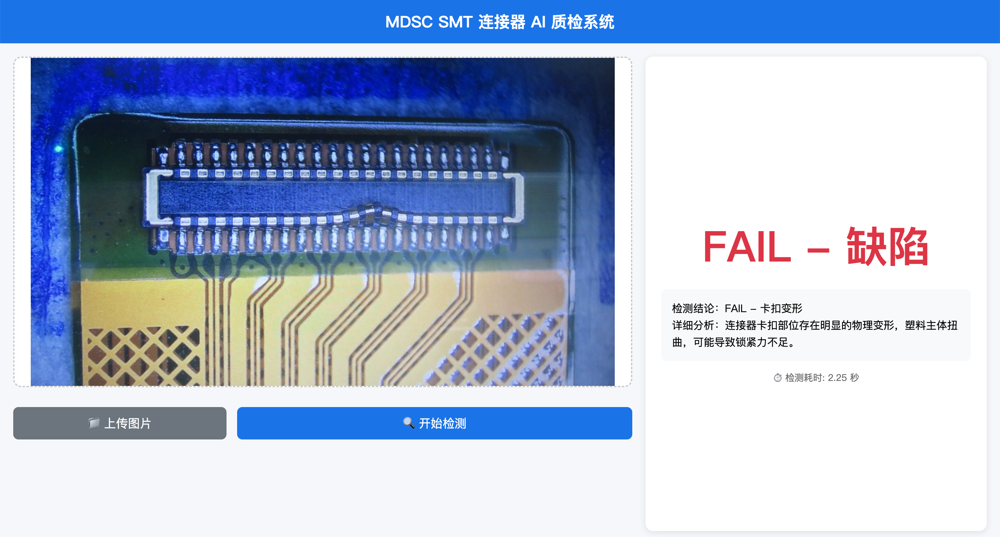

# MDSC SMT 连接器 AI 质检系统

基于 **Qwen2.5-VL 7B** 与 **LoRA** 微调权重的 SMT 连接器外观缺陷（如卡扣变形、连锡等）AI 质检 Web 服务。



## 🚀 部署教程

### 1. 环境准备

确保已安装 Python 3.10+ 环境，按需创建并激活虚拟环境：

```bash
python -m venv .venv
source .venv/bin/activate  # Windows 为 .venv\Scripts\activate
```

安装核心依赖库：

```bash
pip install -r requirements.txt
```

### 2. 模型下载与存放

本系统需要配套基座大模型与专属 LoRA 权重方可进行质检推理。请将它们准备好并放置于对应目录：

**① 准备基座大模型 (Base Model)**

- 下载方式：在项目根目录运行 `python download_model_2.5.py`
- 存放路径：`./models/Qwen/Qwen2.5-VL-7B-Instruct/`

**② 准备 SMT 专门质检权重 (LoRA)**

- 下载地址：[百度网盘获取](https://pan.baidu.com/s/1fap2NDM5fyDp00G3nkNirg?pwd=629p) (提取码: `629p`)
- 下载文件：`qwen2.5vl_7b_instruct_smt.tar.gz`
- 存放路径：解压放入 `./sft_models/qwen2.5vl_7b_instruct_smt/`
  *(注意：该目录下需确保存在 `adapter_config.json` 与 `adapter_model.safetensors`)*

> 💡 **路径提示**：如果有变更存放位置，请在 `main.py` 顶部的配置区直接修改 `BASE_MODEL_PATH` 或 `LORA_PATH` 参数即可。

### 3. 运行前确认 (Mock 开发开关)

若您仅需测试前端交互（跳过重度模型加载），可在 `main.py` 开启模拟运行：

```python
ENABLE_MOCK_MODEL = True   # UI 开发测试
ENABLE_MOCK_MODEL = False  # 真实模型推理（线上环境）
```

> *注：真实模型加载阶段对显存或内存有硬性要求，推荐在配备大显存 GPU 的设备上运行 False 模式以保障性能。*

### 4. 启动服务

使用 Uvicorn 启动核心服务：

```bash
uvicorn main:app --host 0.0.0.0 --port 8080
```

服务就绪后，打开浏览器访问控制面板进行上传与交互操作：
**[http://localhost:8080](http://localhost:8080)**
